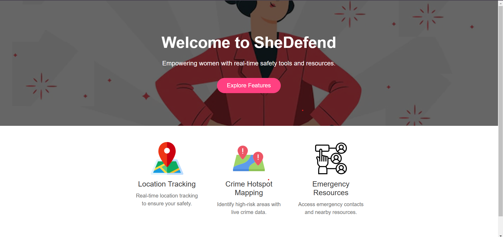

# SheDefend: Empowering Women's Safety  

SheDefend is a comprehensive safety app built with Flutter, designed to empower women with essential tools for personal security. With its user-friendly interface and robust features, SheDefend strives to foster a safer environment for women everywhere.  

  

## Key Features  

- **SOS Alert Feature**: Notifies emergency contacts instantly in case of danger.
- **Emergency Contacts**: Integrated women and police helplines for quick access.
- **Community Chat**: A space for users to discuss safety concerns and share experiences.
- **Resources Section**: Provides safety tips and self-defense techniques.
- **Interactive Crime Map**: Displays crime hotspots with descriptions and safety alerts within a 200m radius.
- **Color-Coded Crime Markers**: Indicate different crime intensities on the map.
- **Crime Reporting**: Allows users to report incidents by tapping on the map, with data stored in a CSV file for display.
- **Crime-Aware Routing**: Uses Flutter polylines and Directions API to suggest safer routes, avoiding high-crime areas.
